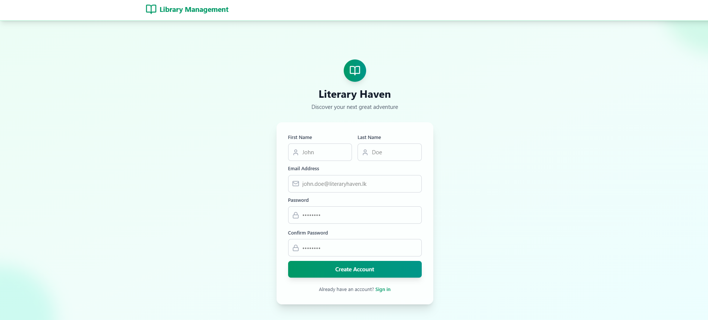
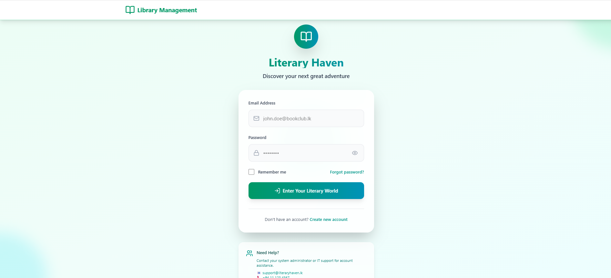
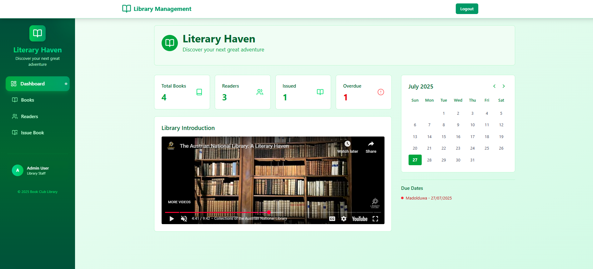
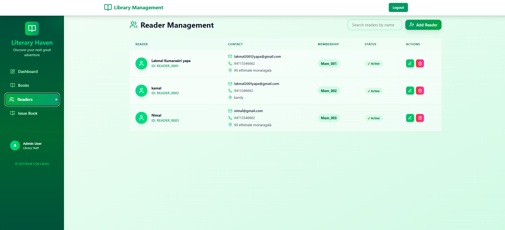
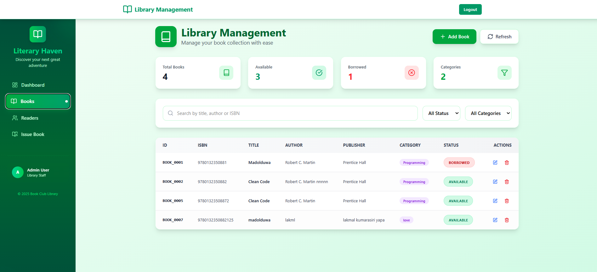

# 📚 Book Club Library Management – Frontend

A full-stack web application frontend built for a library based in Colombo, Sri Lanka. This system helps manage books, readers, lending transactions, and overdue tracking. This is the **frontend** part of the system developed using **React**, **TypeScript**, and **Tailwind CSS**.

## ✨ Features

* 🔐 **Authentication** – Login system for authorized staff
* 👤 **Reader Management** – Add, edit, view, and delete readers
* 📚 **Book Management** – Add, edit, view, and delete books
* 📖 **Lending System** – Lend and return books, track lending history
* ⏰ **Overdue Management** – Display overdue books and readers
* ✉️ **Email Notifications** – Notify readers about overdue books
* 🔍 **Search & Filters** – Easy search for readers and books
* 🧾 **Audit Logging** – Track lending, return, and deletion actions
* 📱 **Responsive UI** – Works across desktops, tablets, and phones

## 🖥️ Tech Stack

| Layer | Technology |
|-------|------------|
| Frontend | React, TypeScript |
| Styling | Tailwind CSS |
| Auth | JWT |
| Backend | Node.js, TypeScript, MongoDB |
| Email | SendGrid or Nodemailer |

## 🚀 Setup Instructions

### 1. **Clone the repository**

```bash
git clone https://github.com/your-username/bookclub-frontend.git
cd bookclub-frontend
```

### 2. **Install dependencies**

```bash
npm install
```

### 3. **Create `.env` file**

Create a `.env` file in the root directory and add:

```bash
VITE_API_BASE_URL=http://localhost:3000/api
```

### 4. **Run the development server**

```bash
npm run dev
```

### 5. **Access the app**

Open your browser and go to [http://localhost:5173](http://localhost:5173)

## 🖼️ Screenshots

*Replace below image links with real paths after uploading them to GitHub or a CDN.*

### 📌 signup


### 📌 Login


### 📌 Dashboard


### 👤 Reader Management


### 📚 Book Catalog


### IssueBook
 (images/viewIssureBook.png)

## 📂 Project Structure (Frontend)

```
bookclub-frontend/
├── public/
├── src/
│   ├── components/
│   │   ├── ui/
│   │   ├── forms/
│   │   ├── tables/
│   │   └── layout/
│   ├── pages/
│   │   ├── auth/
│   │   ├── dashboard/
│   │   ├── readers/
│   │   ├── books/
│   │   └── lending/
│   ├── services/
│   │   ├── api.ts
│   │   ├── auth.ts
│   │   └── endpoints.ts
│   ├── context/
│   │   ├── AuthContext.tsx
│   │   └── AppContext.tsx
│   ├── hooks/
│   │   ├── useAuth.ts
│   │   └── useApi.ts
│   ├── routes/
│   │   └── AppRoutes.tsx
│   ├── types/
│   │   └── index.ts
│   ├── utils/
│   │   └── helpers.ts
│   ├── App.tsx
│   └── main.tsx
├── tailwind.config.js
├── tsconfig.json
├── vite.config.ts
└── package.json
```

## 🛠️ Available Scripts

```bash
# Development
npm run dev          # Start development server
npm run build        # Build for production
npm run preview      # Preview production build
npm run lint         # Run ESLint
npm run type-check   # TypeScript type checking
```

## 🔧 Environment Variables

Create a `.env` file in the root directory:

```env
# API Configuration
VITE_API_BASE_URL=http://localhost:3000/api

# Optional: For production
VITE_APP_TITLE=Book Club Library Management
VITE_APP_VERSION=1.0.0
```

## 📋 Prerequisites

- **Node.js** (v16 or higher)
- **npm** or **yarn**
- **Git**

## ✅ Development Status

- [x] Basic UI Components
- [x] API Integration
- [x] JWT Authentication
- [x] Reader & Book CRUD Operations
- [x] Lending Logic Implementation
- [x] Overdue Notification System
- [ ] Final UI Polish
- [ ] Deployment Setup
- [ ] Unit Tests
- [ ] E2E Tests

## 🚀 Deployment

### Vercel Deployment

```bash
# Install Vercel CLI
npm i -g vercel

# Deploy
vercel --prod
```

### Netlify Deployment

```bash
# Build the project
npm run build

# Deploy dist folder to Netlify
```

## 🤝 Contributing

1. Fork the repository
2. Create your feature branch (`git checkout -b feature/AmazingFeature`)
3. Commit your changes (`git commit -m 'Add some AmazingFeature'`)
4. Push to the branch (`git push origin feature/AmazingFeature`)
5. Open a Pull Request

## 🐛 Known Issues

- [ ] Mobile responsiveness needs improvement on some components
- [ ] Search functionality could be optimized for better performance
- [ ] Email notifications require backend configuration

## 📚 Documentation

- [API Documentation](./docs/API.md)
- [Component Documentation](./docs/COMPONENTS.md)
- [Deployment Guide](./docs/DEPLOYMENT.md)

## 🔗 Related Repositories

- [Backend Repository](https://github.com/your-username/bookclub-backend)
- [Mobile App](https://github.com/your-username/bookclub-mobile)

## 🙋‍♂️ Author

**Lakmal Kumarasiri Yapa**  
📍 Monaragala, Sri Lanka  
🧑‍💻 Software Engineering Undergraduate @ IJSE  
🔗 [LinkedIn](https://linkedin.com/in/your-profile) | [GitHub](https://github.com/your-username)

## 📞 Support

If you have any questions or need help with setup, please:

1. Check the [Issues](https://github.com/your-username/bookclub-frontend/issues) page
2. Create a new issue if your problem isn't already listed
3. Contact me via LinkedIn for urgent matters

## 📝 License

This project is licensed under the MIT License - see the [LICENSE](LICENSE) file for details.

## 🙏 Acknowledgments

- IJSE for providing the learning platform
- React community for excellent documentation
- Tailwind CSS for the amazing utility-first framework
- All contributors and testers

---

**Made with ❤️ in Sri Lanka**
